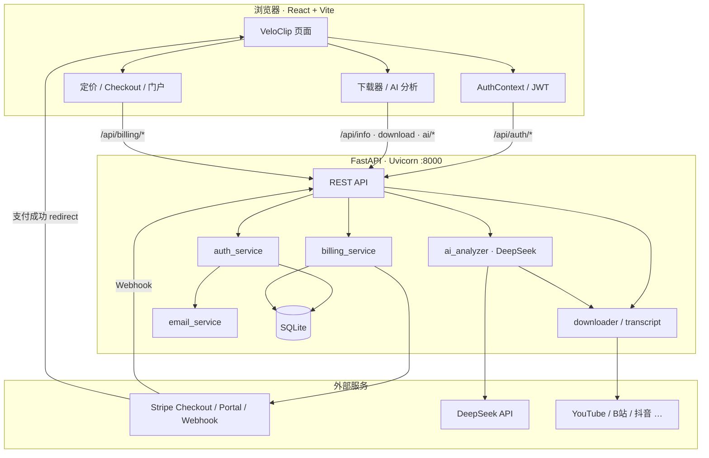

# VeloClip · 万能视频下载网站

一个轻量的全平台视频下载与 AI 分析网站：**Python (FastAPI) + yt-dlp** 提供解析与下载，**React + Tailwind** 打造商业化界面。支持粘贴直链或嵌入页链接，在浏览器中完成解析、下载与 DeepSeek 智能总结。

> 核心理念：站在巨人肩膀上，直接封装开源项目 [yt-dlp](https://github.com/yt-dlp/yt-dlp)，不重复造轮子。

**仓库**：https://github.com/qwy000/veloclip

## 系统架构



| 模块 | 职责 |
| --- | --- |
| **前端** | 落地页、视频解析下载、AI 分析、登录注册、Stripe Checkout 跳转、支付成功同步 |
| **认证** | JWT 登录、邮箱验证码、魔法链接；开发模式验证码打印到控制台 |
| **计费** | Pro 月订 / 旗舰一次性购买；Webhook 或 `sync-checkout` 更新会员；Portal 取消续费 |
| **下载** | yt-dlp 解析与拉流、ffmpeg 合流、内存任务进度 |
| **AI** | 字幕提取 + DeepSeek 总结 / 思维导图 / 问答 |

## 功能

### 视频下载

- 全平台视频解析与下载（YouTube / B 站 / 抖音 / TikTok / X 等上千站点）
- **课程/文章页嵌入视频自动识别**（从 HTML 提取 B 站、YouTube 等直链）
- 清晰度自选（**最佳画质标注具体分辨率** / 720p / 480p / … / 仅音频 MP3）
- 实时下载进度（百分比 / 速度 / 剩余时间）
- 高清音视频自动合并（内置 ffmpeg，免手动安装）
- 可选平台 Cookie（`backend/cookies/`，用于需登录的内容）

### AI 视频分析（解析页内嵌）

- 字幕提取（CC / 自动字幕 / B 站弹幕兜底）
- **无字幕元数据降级**（X 等平台：基于标题、简介等继续分析）
- DeepSeek 总结、思维导图（全屏 / 导出 PNG）、AI 提问
- `subtitle_source`：`cc` | `auto` | `danmaku` | `metadata`

### 会员与支付（Stripe）

- 邮箱 + 密码注册，**邮箱验证码**激活账号
- **魔法链接**免密登录
- **Pro 会员**：Stripe 月订（自动续费，可在 Customer Portal 取消）
- **旗舰版**：Stripe **一次性购买 12 个月**（到期不自动续费）
- 会员状态查询（本期**暂不限制**下载/AI 功能，先打通支付链路）
- SQLite 持久化用户与订阅；Webhook **验签 + 事件幂等**

### 界面

- 品牌 **VeloClip**，响应式商业化 UI
- 会员定价三档 + Stripe Checkout 支付
- 导航栏展示登录状态与会员等级

## 技术栈

| 层级 | 技术 |
| --- | --- |
| 后端 | FastAPI、Uvicorn、yt-dlp、imageio-ffmpeg、DeepSeek API、Stripe |
| 前端 | Vite、React、TypeScript、TailwindCSS、lucide-react、react-router-dom |
| 存储 | SQLite（用户/订阅）+ 内存任务表 + 临时下载目录 |

## 目录结构

```
backend/          FastAPI 后端 + yt-dlp 封装
  app/core/       database、config、security
  app/services/   downloader、transcript、auth、billing、email
  data/           SQLite（gitignore）
  cookies/        各平台 Netscape Cookie（不入库）
  tests/          单元测试
frontend/         Vite + React 前端
docs/             需求分析 / 方案设计
```

## 本地运行

### 1. 启动后端（开发端口 8000）

```bash
cd backend
pip install -r requirements.txt
uvicorn app.main:app --reload --port 8000
```

> 前端 Vite 代理指向 **8000**。若端口被僵尸 python 占用，请在任务管理器结束对应 `python.exe` 后再启动。  
> 修改后端代码后需重启 uvicorn；可访问 `GET /health` 查看 `pid` 与 `features` 确认是否为新进程。

复制 `backend/.env.example` 为 `backend/.env` 并填写：

- `DEEPSEEK_API_KEY` — 启用 AI 分析
- `JWT_SECRET` — 认证密钥（生产务必更换）
- `STRIPE_*` — 见下方「Stripe 本地测试」

### 3. Stripe 本地测试（无需公网 IP）

需要能访问 `api.stripe.com`（Stripe CLI 与 Checkout 均依赖外网）。**不需要**公网域名或 Dashboard 配置 Webhook URL。

**① Dashboard（Test mode）创建 Product / Price**

| 方案 | Stripe 类型 | 建议价格 |
| --- | --- | --- |
| Pro | Recurring · Monthly | ¥19 CNY（不支持则 USD $2.99） |
| 旗舰 | **One time**（一次性） | ¥149 CNY（不支持则 USD $19.99） |

复制两个 **Price ID**（`price_...`）到 `.env`。

**② 填写 `.env`**

```env
STRIPE_SECRET_KEY=sk_test_...
STRIPE_WEBHOOK_SECRET=whsec_...        # 见下一步 stripe listen 输出
STRIPE_PRICE_PRO_MONTHLY=price_...
STRIPE_PRICE_ULTIMATE_ONETIME=price_...
STRIPE_CURRENCY=cny                    # 不支持 CNY 时改为 usd
APP_BASE_URL=http://localhost:5173
JWT_SECRET=请换成随机长字符串
DEV_EMAIL_LOG=true                     # 验证码/魔法链接打印到后端控制台
```

**③ 启动 Stripe CLI 转发 Webhook**（单独开一个终端，保持运行）

```bash
stripe login
stripe listen --forward-to localhost:8000/api/billing/webhook
```

把输出的 `whsec_...` 写入 `STRIPE_WEBHOOK_SECRET`，重启后端。

**④ 测试卡**

| 卡号 | 结果 |
| --- | --- |
| `4242 4242 4242 4242` | 成功 |
| `4000 0025 0000 3155` | 需 3DS 验证 |
| `4000 0000 0000 9995` | 拒绝 |

有效期任意未来日期，CVC 任意 3 位。

**⑤ 完整支付流程**

1. 打开 http://localhost:5173 → 注册 → 在后端控制台复制 **6 位验证码** → 验证登录  
2. 定价区点击「升级 Pro」或「购买旗舰版」→ 跳转 Stripe Checkout → 用测试卡支付  
3. Webhook 或支付成功页自动同步后，导航栏显示会员等级；也可 `GET /api/billing/status`（需 Bearer Token）

开发模式下验证码与魔法链接会打印在后端日志（`=== EMAIL (dev) ===`），无需配置 SMTP。

### 4. 启动前端（端口 5173）

```bash
cd frontend
npm install
npm run dev
```

浏览器打开 http://localhost:5173 即可使用。

## 测试

```bash
# 认证与计费
cd backend && python -m unittest tests.test_auth_billing -v

# 字幕与解析单元测试
cd backend && python -m unittest tests.test_transcript -v

# B 站 AI 联调（--analyze 需 DeepSeek Key）
python scripts/test_ai_integration.py --url "https://www.bilibili.com/video/BV1dD42137cz/"
```

## API 摘要

| 方法 | 路径 | 说明 |
| --- | --- | --- |
| POST | `/api/info` | 解析视频信息与可选清晰度 |
| POST | `/api/download` | 创建下载任务 |
| GET | `/api/progress/{task_id}` | 查询下载进度 |
| POST | `/api/cancel/{task_id}` | 取消下载 |
| GET | `/api/file/{task_id}` | 下载完成的文件 |
| POST | `/api/ai/analyze` | AI 总结 + 思维导图 |
| POST | `/api/ai/transcript` | 仅提取字幕（严格模式） |
| POST | `/api/ai/chat` | 基于字幕或元数据的问答 |
| POST | `/api/auth/register` | 注册（发邮箱验证码） |
| POST | `/api/auth/verify-email` | 验证邮箱并登录 |
| POST | `/api/auth/login` | 密码登录 |
| POST | `/api/auth/magic-link` | 发送魔法链接 |
| GET | `/api/auth/me` | 当前用户（Bearer Token） |
| GET | `/api/billing/plans` | 可购方案列表 |
| POST | `/api/billing/checkout` | 创建 Stripe Checkout |
| POST | `/api/billing/sync-checkout` | 支付成功页同步会员（Webhook 兜底） |
| GET | `/api/billing/status` | 会员状态 |
| POST | `/api/billing/portal` | Stripe 订阅管理门户 |
| POST | `/api/billing/webhook` | Stripe Webhook（Stripe 调用） |
| GET | `/health` | 健康检查（含 `pid`） |

## 文档

- [需求分析](docs/需求分析.md)
- [方案设计](docs/方案设计.md)

## 免责声明

本工具仅供个人学习与合规使用。请遵守各平台服务条款与版权规定，勿用于侵犯他人版权或违规用途；下载内容的使用责任由用户自行承担。本站不持久存储用户下载的视频文件。
