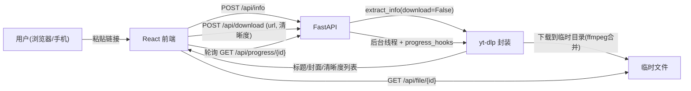
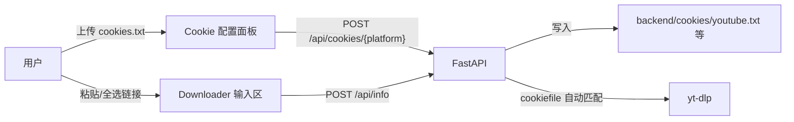

# 方案设计文档 — 万能视频下载网站

> 本文档沉淀技术方案、架构、接口契约、目录结构与关键实现细节，供后续扩展功能时为 AI / 团队提供参考。

## 1. 总体设计原则

- **站在巨人肩膀上**：核心下载能力直接封装 [yt-dlp](https://github.com/yt-dlp/yt-dlp) 的 Python API（`YoutubeDL` 类），不修改其源码、不拼接脆弱的命令行子进程，改动量最小。
- **轻量无数据库**：任务状态用进程内内存字典管理；临时文件下载完成后清理。
- **前后端分离**：Python(FastAPI) 提供 API，React 前端负责商业化界面。
- **以 Python 为核心**：下载是项目核心，用 Python 实现；前端为展示层。

## 2. 技术栈

| 层 | 选型 | 说明 |
| --- | --- | --- |
| 后端框架 | FastAPI + Uvicorn | 轻量、异步、自带 OpenAPI 文档 |
| 下载引擎 | yt-dlp | 主流开源下载器，支持 1000+ 站点 |
| 媒体处理 | imageio-ffmpeg | 提供 ffmpeg 二进制，合并视频流+音频流，免手动安装 |
| 数据校验 | Pydantic | 请求/响应模型 |
| 前端 | Vite + React + TypeScript | 现代前端工程，零 SSR 复杂度 |
| 样式 | TailwindCSS + lucide-react | 复刻参考站浅色蓝调风格 |

## 3. 架构与数据流



## 4. 目录结构

```
free-video-downloader/
  backend/
    app/
      main.py                 # FastAPI 实例、CORS、路由挂载
      api/routes.py           # API 路由
      services/downloader.py  # yt-dlp 封装(解析/下载/进度hook/ffmpeg定位)
      core/tasks.py           # 内存任务表 + 临时目录管理 + 清理
      models/schemas.py       # Pydantic 请求/响应模型
    requirements.txt
    downloads/                # 临时输出(gitignore)
  frontend/                   # Vite+React+TS+Tailwind
    src/
      components/             # Navbar/Hero/Downloader/Steps/Features/Pricing/FAQ/Footer
      lib/api.ts              # 前端 API 封装
      App.tsx / main.tsx / index.css
    vite.config.ts            # 含 /api 代理到后端
  docs/                       # 需求分析 / 方案设计
  README.md
```

## 5. 接口契约（REST）

### 5.1 POST /api/info — 解析视频信息
请求：`{ "url": "https://..." }`

响应：
```json
{
  "title": "视频标题",
  "thumbnail": "封面URL",
  "duration": 123,
  "uploader": "作者",
  "formats": [
    { "quality": "1080p", "label": "1080p MP4", "format_id": "...", "ext": "mp4", "filesize": 12345678, "type": "video" },
    { "quality": "audio", "label": "仅音频 MP3", "format_id": "bestaudio", "ext": "mp3", "type": "audio" }
  ]
}
```

### 5.2 POST /api/download — 创建下载任务
请求：`{ "url": "https://...", "quality": "1080p" }`

响应：`{ "task_id": "uuid" }`

> 后端将下载放入**后台线程池**执行（yt-dlp 为阻塞调用），通过 `progress_hooks` 回写进度到内存任务表。

### 5.3 GET /api/progress/{task_id} — 查询进度（前端轮询）
响应：
```json
{
  "status": "downloading | finished | error | queued",
  "percent": 42.5,
  "speed": "3.2 MiB/s",
  "eta": "00:12",
  "filename": "video.mp4",
  "error": null
}
```

### 5.4 GET /api/file/{task_id} — 下载文件
返回 `FileResponse`，浏览器触发下载；下载后/定时清理临时文件。

## 6. 关键实现细节

### 6.1 yt-dlp 封装（services/downloader.py）
- **解析**：`YoutubeDL({'quiet': True, 'skip_download': True}).extract_info(url, download=False)`，从 `info['formats']` 中按 `height` 归并出 1080p/720p/480p/360p 档位，附加"最佳画质"与"仅音频 MP3"。
- **下载**：根据清晰度构造 `format` 选择串，例如：
  - 1080p：`bestvideo[height<=1080]+bestaudio/best[height<=1080]`
  - 仅音频：`bestaudio/best` + `postprocessors`(FFmpegExtractAudio → mp3)
- **ffmpeg 定位**：`ffmpeg_location = imageio_ffmpeg.get_ffmpeg_exe()`，传入 `YoutubeDL` 选项，保证合并/转码可用。
- **进度**：`progress_hooks=[hook]`，在 hook 中读取 `d['status']/_percent_str/_speed_str/_eta_str`，写入内存任务表。
- **输出**：`outtmpl` 指向每个任务独立的临时子目录，`merge_output_format='mp4'`。

### 6.2 内存任务表（core/tasks.py）
- 结构：`tasks[task_id] = { status, percent, speed, eta, filepath, filename, error, created_at }`。
- 每个任务一个独立临时目录（`tempfile`/`downloads/<task_id>/`）。
- 清理策略：文件被下载后或创建超过 N 分钟后删除目录，避免磁盘堆积。

### 6.3 并发与阻塞
- yt-dlp 下载是阻塞操作，使用 `ThreadPoolExecutor` / FastAPI 后台任务执行，避免阻塞事件循环。

## 7. 前端设计（复刻参考站风格）

参考 `https://ai.codefather.cn/painting` 提取的品牌令牌：

| 令牌 | 值 |
| --- | --- |
| 主强调色 | `#1777FF`（蓝） |
| 文字主色 | `#0F172A` / `#1F1F1F` |
| 背景 | `#FFFFFF` + 浅色分区 |
| 主按钮 | 蓝色**胶囊形**（圆角全） |
| 次按钮 | 白底 + 浅边框 `#F2F2F2` + 轻阴影，圆角 12px |
| 卡片圆角 | 12px |
| 字体 | 系统无衬线 / Roboto |

页面区块（营销 + 工具一体单页）：
1. 顶部导航（Logo + 链接 + "升级 Pro" 蓝色胶囊 CTA）
2. Hero（大标题 + 副标题 + URL 输入 + "立即下载"按钮 + 信任标签 + 平台 Logo 行）
3. 下载工作区（封面卡片 + 清晰度下拉 + 下载按钮 + 进度条 + 完成下载链接）
4. 使用步骤（3 步）
5. 功能特性网格（6 卡）
6. 定价区块（免费 / Pro / 旗舰，高亮 Pro，纯视觉）
7. FAQ
8. Footer + 免责声明

为视频品牌增加蓝→靛蓝渐变点缀，保持独特但克制；移动端单列、触控友好。

## 8. 本地运行

```bash
# 后端
cd backend
pip install -r requirements.txt
uvicorn app.main:app --reload --port 8000

# 前端
cd frontend
npm install
npm run dev   # http://localhost:5173，/api 代理到 8000
```

## 9. 后续扩展指引（给未来的 AI / 开发者）

- **真实付费**：引入账号体系 + 数据库（如 SQLite/Postgres）+ 支付（微信/支付宝/Stripe），将定价区块接真实下单。
- **AI 能力**：新增 `/api/summarize`、`/api/translate-subtitle`，调用大模型；下载流程可复用现有任务表。
- **批量下载**：扩展任务表为队列，前端增加批量输入与列表管理。
- **持久化历史**：引入数据库记录下载历史与用户配额。

## 10. 平台反爬与下载兼容性方案（核心攻坚，2026-06-12）

各大平台对自动化请求有不同强度的反爬。本节沉淀**逐平台诊断结论**与**解决方案**，
原则是**尽量免登录、免 Cookie**（用户反馈 Cookie 很不便）。

### 10.1 抖音 Douyin —— ✅ 已解决（URL 规范化）

- 现象：`https://www.douyin.com/jingxuan?modal_id=7649705189502389519` 报 `Unsupported URL`。
- 根因：yt-dlp 只认 `https://www.douyin.com/video/{id}`，不认"精选页 + modal_id"形式。
- 方案：在 `downloader.py::normalize_url()` 中把 `modal_id` 查询参数提取为标准 `/video/{id}`；
  并对短链 `v.douyin.com` 跟随重定向后再规范化。**免 Cookie 成功**（含 ffmpeg 合并）。

### 10.2 哔哩哔哩 Bilibili —— ✅ 已解决并实测（免 Cookie 打通）

逐层诊断结论（关键）：
1. B 站**仅 `/video/*` 网页路径**被 WAF 拦截，返回 412 风控页；首页等路径均 200。
2. **B 站开放 API 免 Cookie 可用**：`view`（视频信息）、`pagelist`（取 cid）、`nav`（WBI 密钥）
   均 200；只有 `playurl`（取流）会 412。
3. yt-dlp 的 `BiliBiliIE` 仅在第一步"下载视频页 HTML"用到网页（读取 `window.__INITIAL_STATE__`），
   之后取流、防盗链 `Referer` 都已自动处理。

**playurl 412 的真正根因（本次实测精确定位，两点缺一不可）**：
- **根因 A：WBI 签名被二次编码破坏。** yt-dlp 原始 `_download_playinfo` 把"已用 `_sign_wbi` 签好的
  query 字典"再次交给网络层（`update_url_query`）做 URL 拼接/二次编码，导致最终发出的查询串与计算
  `w_rid` 时的串不一致，签名失效 → 412。对照实验：用 yt-dlp 自身的 `_sign_wbi` 结果**拼成完整 URL**
  后用 urllib/curl_cffi 直接请求 playurl，**免 Cookie 返回 200（code 0，含 dash）**。
- **根因 B：Referer 指向被风控的 `/video/` 页面也会 412。** `_real_extract` 把 `Referer` 设为视频页 URL
  并透传给 playurl；实测把 Referer 换成站点首页 `https://www.bilibili.com/` 即 200。
- 注意：**与浏览器 UA 无关**——抓包确认 playurl 请求本就带了全局注入的浏览器 UA，仍 412；
  也与 buvid3/buvid4、TLS 指纹（curl_cffi impersonate）无关，均已逐一排除。

方案（不改 yt-dlp 源码，运行时 monkeypatch，见 `app/services/bili_patch.py`）：
1. 拦截 `BiliBiliIE._download_webpage_handle`：当 `/video/` 网页被拦时，用 `view` API 数据
   **合成含 `window.__INITIAL_STATE__` 的 HTML** 返回（`initial_state = {'videoData': <view.data>,
   'upData': {name, mid}}`），使后续流程照常。
2. **覆盖 `BiliBiliIE._download_playinfo`**：在补丁内自行调用 `self._sign_wbi(params, bvid)` 完成 WBI 签名，
   拼成**完整 URL** 后直接传给 `_download_json`（不再用 `query=` 二次编码），并把 `Referer` 固定为
   站点首页、`User-Agent` 固定为桌面 UA。仍走 yt-dlp 网络层，保留 cookie / 代理能力。
3. 覆盖 `geo_verification_headers()` 注入桌面 UA 作为兜底。
4. 在 `downloader.py` 顶部调用 `bili_patch.apply_patch()`。

**实测结论**：免 Cookie 完成 解析→选清晰度→下载→ffmpeg 合并→ffprobe 校验（av1+aac，文件可播放）。
免登录最高约 480p/720p（4K/1080P60/大会员档位需会员，yt-dlp 会提示"become a premium member"）。

### 10.3 YouTube —— ⛔ 本期不支持（已知限制）

- 现象：`Sign in to confirm you're not a bot`（人机验证），IP 信誉级风控。
- 已尝试且无效：`extractor_args.youtube.player_client=[tv, web_safari, android]`、`curl_cffi` 指纹伪装。
- 本轮决策：**不投入免 Cookie 攻坚**。保留 Cookie 兜底路径与 `_friendly_error` 的人机验证中文提示。
- 后续可探索：PO Token provider（bgutil）、不同 player_client 组合、干净住宅 IP / 代理、必要时回退 Cookie。

### 10.2.1 其它全局修复（本次）

- **ffmpeg 定位（影响所有需合并的平台）**：`ffmpeg_location` 必须传 ffmpeg **二进制完整路径**
  （`imageio_ffmpeg.get_ffmpeg_exe()`）。此前传的是目录，yt-dlp 只按标准名 `ffmpeg.exe` 在目录里查找，
  而 imageio 的文件名为 `ffmpeg-win64-vX.Y.Z.exe`，匹配不到 → "ffmpeg is not installed" 无法合并。
  传完整路径时 yt-dlp 用 `'ffmpeg' in filename` 识别并直接采用。
- **duration 取整**：部分平台（如 B 站）返回浮点时长，`InfoResponse.duration` 为 int，已做 `int()` 归一。
- **socket_timeout=20**：防止个别平台（直播流 / 失效链接）请求长时间挂起。
- **西瓜 URL 规范化**：`m.ixigua.com/dx/{id}` 等 → `https://www.ixigua.com/{id}/`（结尾斜杠避免提取器
  正则贪婪匹配丢末位数字）。
- **友好错误**：新增对 "cookie" 关键字的中文提示（西瓜/快手/微博等需 Cookie 平台）。

### 10.4 其它平台

- TikTok：免 Cookie 可用（实测）。
- 抖音：免 Cookie 可用（实测，URL 规范化已覆盖 modal_id / 短链）。
- 西瓜 Ixigua：已加 URL 规范化；提取器明确要求 Cookie（即便非登录态），放置 `cookies/ixigua.txt` 后可用。
- 快手 Kuaishou：网页取流需 Cookie；已加 `v.kuaishou.com` 短链跟随。
- 微博 Weibo：`tv/show/{id}` 等取流多需 Cookie；偶发 SSL 中断可重试。
- X/Twitter：普通公开视频推文（`/status/{id}`）提取器路径存在；直播 broadcast 链接会慢/超时
  （已加 `socket_timeout` 防挂起），需有效公开普通视频推文复验。
- Instagram：多需登录 Cookie。

### 10.5 通用反爬基础设施（已实现）

- **浏览器 UA**：`_base_opts()` 默认注入桌面 Chrome UA。
- **指纹伪装**：已安装 `curl_cffi`，可通过 `impersonate=ImpersonateTarget.from_str('chrome')` 启用浏览器 TLS 指纹
  （注意 Python API 必须传 `ImpersonateTarget` 对象，不能传字符串）。
- **URL 规范化**：`normalize_url()` 处理抖音 modal_id/短链，可扩展其它平台。
- **Cookie 兜底**（非主路径）：`backend/cookies/<平台>.txt` 自动按域名匹配；或 `YTDLP_COOKIES` / `YTDLP_COOKIES_FROM_BROWSER` 环境变量。
- **友好错误**：`_friendly_error()` 针对人机验证 / 412 / 登录态 / DRM 返回中文提示。

### 10.6 依赖变更

- 新增 `curl_cffi`（浏览器指纹伪装）。requirements.txt 需补充（见下）。

### 10.7 新对话继续开发的入口提示

- B 站：✅ 已免 Cookie 打通（见 10.2），如再现 412 优先核对 `_download_playinfo` 补丁是否仍生效
  （检查发出的 playurl 是否"完整 URL + 首页 Referer"）。
- YouTube：本期不支持；如要攻坚优先尝试 PO Token provider（bgutil）/ player_client 组合；
  免 Cookie 不通再考虑 Cookie 兜底。
- 待验证平台（X/微博/快手/Instagram）：需有效公开链接；需 Cookie 的平台放置 `cookies/<平台>.txt`。
- 测试用的当前有效 B 站视频可通过 `https://api.bilibili.com/x/web-interface/popular` 获取最新 bvid；
  注意短时间内对 B 站发起大量请求会触发 IP 级 412 限流，间隔重试即可。
- 调试提示：本地若已有占用 8000 端口的旧后端进程，新启动的 uvicorn 会**绑定失败并退出**，
  请求会打到旧代码上造成"改了没生效"的假象——改完务必确认监听 8000 的是最新进程。

## 11. 多任务下载与体验修复（已实现，2026-06-13）

针对用户反馈的五类问题，已完成前后端联动修复：

| 问题 | 根因 | 方案 |
| --- | --- | --- |
| 无法中断下载 | 无取消机制 | `Task._cancel_event` + `POST /api/cancel/{task_id}`；hook 内检测 `is_cancelled` 中止 yt-dlp |
| 多任务不可见 | 前端仅单一 `phase/taskId` 状态 | `Downloader.tsx` 改为 `tasks[]` 列表，每任务独立轮询与卡片 |
| 视频播放几秒后中断 | MP4 moov 在文件尾；非 h264 编码塞入 MP4 | `postprocessor_args Merger: -movflags +faststart`；format 优先 `avc1+mp4a` |
| 长视频进度条闪跳 | 视频流/音频流各自从 0% 起算 | `_make_hook` 维护 `max_pct` 单调递增，下载阶段上限 95% |
| 保存无限弹窗 | finished 轮询重复触发 `triggerBrowserDownload` | `triggeredRef` Set 确保每任务仅自动下载一次 |

**涉及文件**：`tasks.py`、`routes.py`、`downloader.py`、`Downloader.tsx`、`api.ts`。

## 12. 全选 / Cookie 网页配置 / 定价布局（待开发，2026-06-13）

> 本节为下一迭代方案，尚未编码实现，供后续 AI / 开发者直接开工。

### 12.1 需求拆解

| 项 | 用户诉求 | 现状 |
| --- | --- | --- |
| 全选按钮 | 输入框旁一键选中全部文字 | 仅有「粘贴」按钮 |
| Cookie 下载 | 爱奇艺、YouTube 等需 Cookie 平台可用 | 仅支持手动放置 `backend/cookies/*.txt`，无 API/前端入口；`PLATFORM_COOKIE_MAP` 未含爱奇艺 |
| 定价布局 | 三档会员水平排列、减少右侧留白 | `lg:grid-cols-3`、卡片 `p-8` 偏宽，Pro 卡 `scale` 造成错位 |

### 12.2 架构（Cookie 网页上传）



### 12.3 全选按钮

- 文件：`frontend/src/components/Downloader.tsx`
- `useRef<HTMLInputElement>` + 「全选」按钮（与「粘贴」并列）
- `handleSelectAll`: `inputRef.current?.focus(); inputRef.current?.select()`

### 12.4 Cookie 下载能力

**后端平台映射**（`downloader.py`）追加：

```python
(("iqiyi.com", "iq.com", "pps.tv"), "iqiyi.txt"),
```

**新增 API**（`routes.py` + `schemas.py`）：

| 方法 | 路径 | 说明 |
| --- | --- | --- |
| GET | `/api/cookies/status` | 各平台 `configured: bool` |
| POST | `/api/cookies/{platform}` | multipart 上传 Netscape 格式 cookies.txt |
| DELETE | `/api/cookies/{platform}` | 删除该平台 Cookie 文件 |

- `platform` 白名单：`youtube`、`bilibili`、`iqiyi`、`douyin`、`tiktok`、`instagram`、`twitter`、`kuaishou`、`ixigua`、`weibo`、`global`
- 上传校验：非空 + Netscape 头或常见 cookie 行；防路径穿越

**前端**（新建 `CookiePanel.tsx`）：

- 可折叠「Cookie 配置」面板，展示各平台已配置/未配置状态
- 每平台文件上传 + 删除；解析失败含「Cookie」时自动展开面板
- `api.ts` 增加 `fetchCookieStatus`、`uploadCookie`、`deleteCookie`

### 12.5 会员定价布局

- 文件：`frontend/src/App.tsx` 中 `Pricing`
- `max-w-5xl mx-auto`；`md:grid-cols-3`（中等屏即三列）
- 卡片 `p-5 md:p-6`；移除 Pro 卡 `scale-[1.02] lg:-mt-2`
- 特性列表 `w-full space-y-2 text-sm`

### 12.6 测试与验收

- 脚本：`backend/scripts/test_cookies_api.py`（Cookie API 回归）
- 构建：`npm run build`
- 浏览器：全选、Cookie 上传、定价三列布局、移动端单列
- 人工：用自导出 YouTube / 爱奇艺 Cookie 试真实链接

### 12.7 涉及文件一览

| 文件 | 变更 |
| --- | --- |
| `frontend/src/components/Downloader.tsx` | 全选按钮 + 挂载 CookiePanel |
| `frontend/src/components/CookiePanel.tsx` | 新建 |
| `frontend/src/lib/api.ts` | Cookie API |
| `frontend/src/App.tsx` | Pricing 布局 |
| `backend/app/api/routes.py` | Cookie 路由 |
| `backend/app/models/schemas.py` | Cookie 响应模型 |
| `backend/app/services/downloader.py` | iqiyi 映射 + 错误文案 |
| `backend/cookies/README.md` | 爱奇艺 + 网页上传说明 |
| `backend/scripts/test_cookies_api.py` | 新建测试脚本 |
